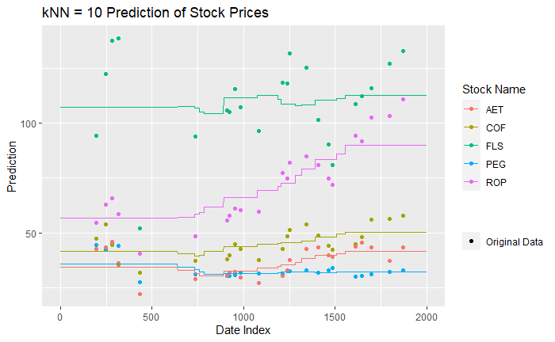
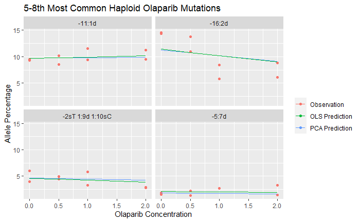

### Introduction

The graphics below represent the same robust work flow. Data is acquired and cleaned, then analyzed with a model. The model generates predictions, which are joined to the original data, then graphed for comparison. In addition to numeric metrics, graphic comparison of models and original data is essential component of model validation in research settings. I hope that the disparate settings of the following two graphics speak to the broad applicability of my work flow, that is to both economic and biological data. 

### Stock Predictions

This is the graphic generated in the final steps of my code sample. It compares the stock prices of five stocks to their prices predicted by the K nearest neighbors method. 

- The actual stock prices are graphed in points. 
- The predictions for each stock's price are represented by a line.
- Color matches stock to prediction.
- The Date Index is in days, spaced for weekends and holidays. 
- While not perfectly continuous, the K nearest neighbors method offers a simple and robust conditional average estimation, not unlike a smoothing method.  

### Biological Graphics

This is a graphic generated for the final report of my previous research experience on the human BRCA2 gene and its mutations. Displayed is a comparison of my novel PCA prediction method alongside an ordinary least-squares prediction on the same data. 

- The red dots represent the observed allele percentages of four mutations found in the experiment. 
- The lines graph each model's predictions. 

Notably, while each of the four panels must have their own OLS model fitted to the data, the PCA model displayed in the four panels is the exact same, having been fit on all sixteen-thousand mutations in the experiment. If you have any questions about this method, please reach me at my [email](waynemonical@berkeley.edu), as I am happy to speak more about it 
